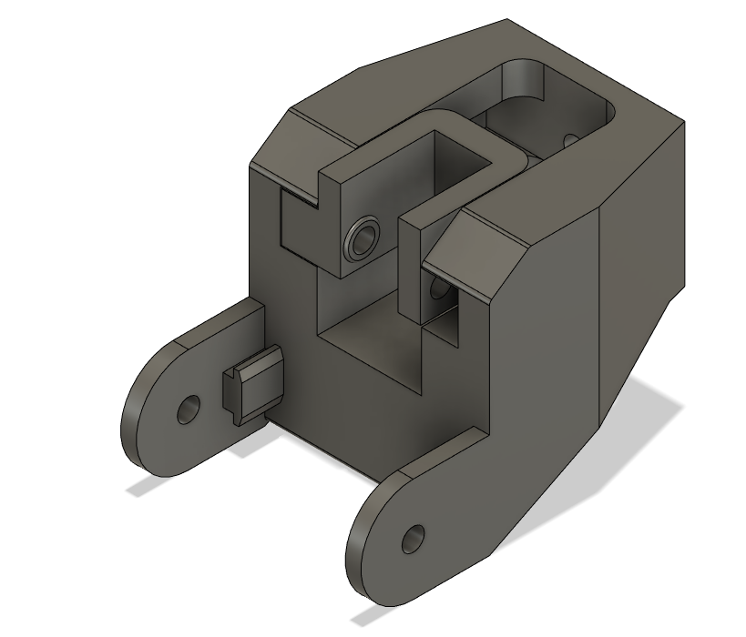

# Y axis tensioner

Y axis tensioner for Ender 3 pro. You can use this design to properly tension your belt for Y axis. The middle part, can be changed for different pulleys/bearings and also adjusted in left/right direction if the belt is binding one of the sides. The right allignment of the belt can decrease vertical artifacts on the print.

### Mounting/Printing tips

-   <i>Full_Body.stl</i> print vertical, without supports
-   <i>Inside.stl</i> - print flat

Inside_+/-1mm can be used to better adjust positiong of the belt, so there is no binding. You can use this model to prepare your own version.

Additional parts:
-   M4 20mm screws - 2x

